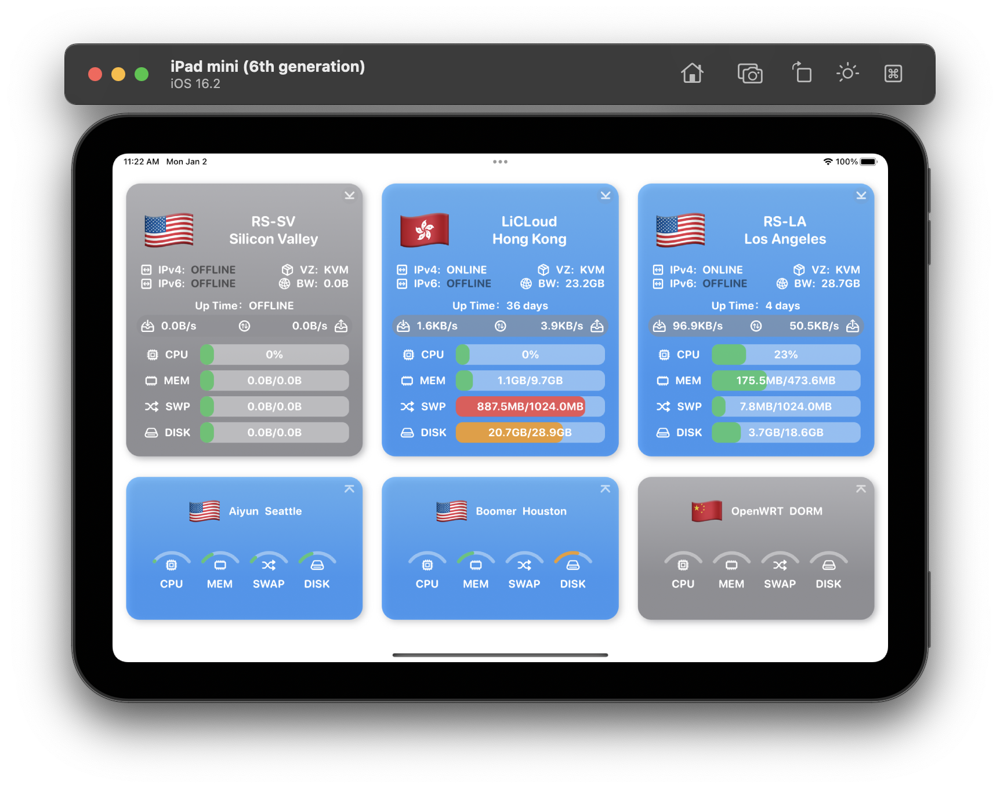
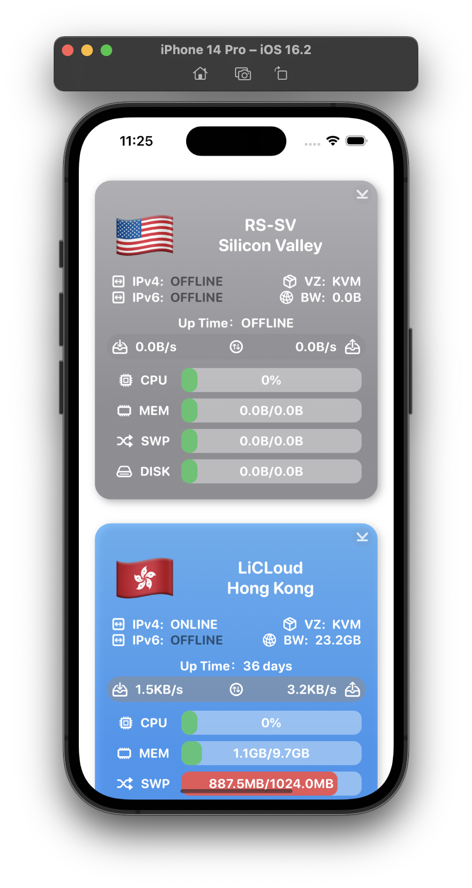

# Notice(UPDATE)

本项目已重写，请前往 [Server-Monitor-App](https://github.com/weirui-kong/Server-Monitor-App) 查看。新版 Server-Monitor-App 拥有更好的 UI 设计，并提供了更高的自由度。

# Notice
鉴于本项目是在Swift初学阶段写的，属于💩⛰️中的💩⛰️，没有用到任何设计模式、不具有可维护性。
决定暑假重构一下，暂时归档。

# Server-Status-Mobile
Server Status Mobile is a light-weight application providing you with real-time infomation of servers based on APIs of several open source projects.

# Supported Platforms
- ✅ macOS
- ✅ iOS
- ✅ iPadOS
- ⭕️ tvOS (scheduled)
- ⭕️ watchOS (scheduled)
- ❌ Android (no schedules)
# Supported APIs
- ✅ [cokemine](https://github.com/cokemine) / [ServerStatus-Hotaru](https://github.com/cokemine/ServerStatus-Hotaru)
- ⭕️ other... (scheduled)
# Previews
## iPad

## iPhone

